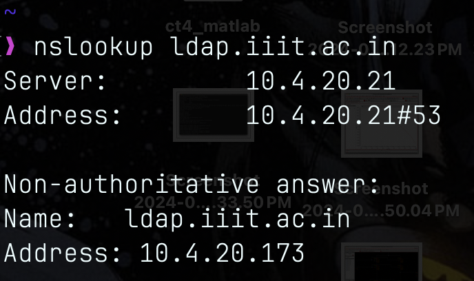
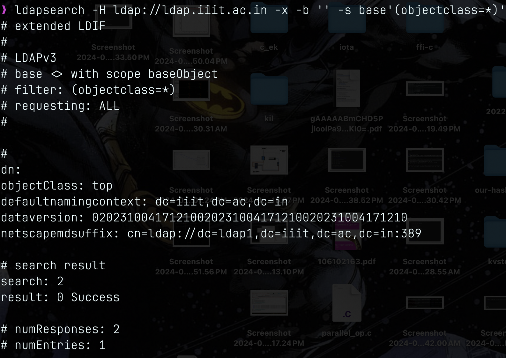
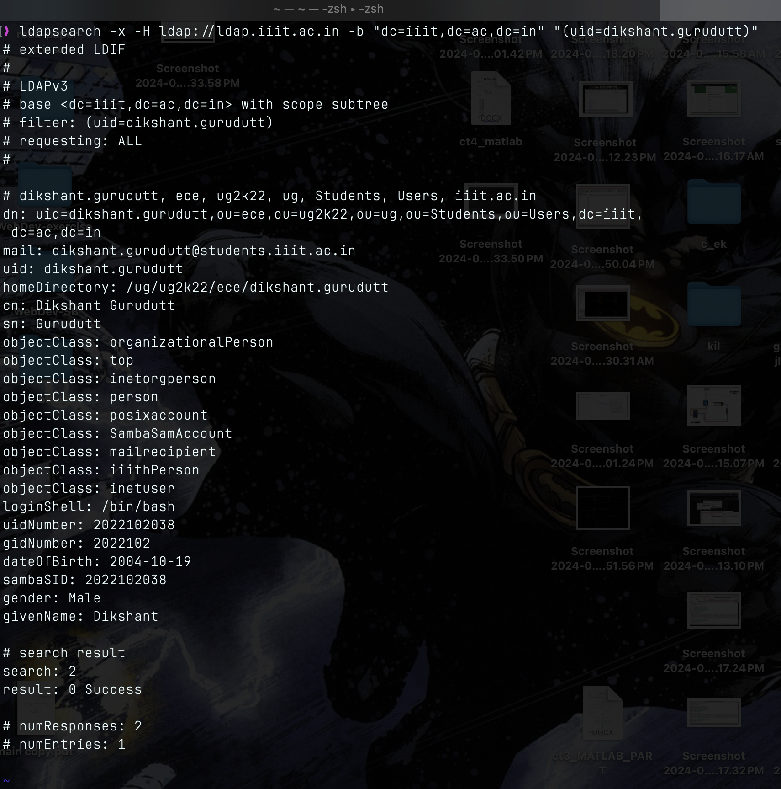
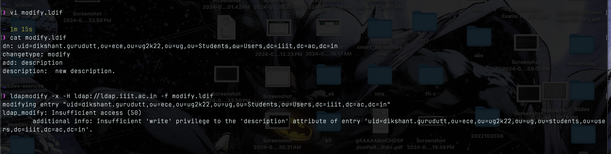

# Question 1:
At IIIT we use LDAP to manage user information — usernames, credentials, along with other metadata. Given that our LDAP url is [ldap.iiit.ac.in](http://ldap.iiit.ac.in/):

1. figure out how you can query the database for your own information
2. append a description field to your entry
3. show how you can use LDAP to find all the students in your batch

## Answer:
### Part1:
- First check the ip address for `ldap://ldap.iiit.ac.in/` using `nslookup` command.

<!--  -->

- Now searching the baseObject to find out dn using `ldapsearch -H ldap://ldap.iiit.ac.in -x -b '' -s base'(objectclass=*)'`. From the output we can say that ldap is using standard naming conventions.
<!--  -->

- Now from the above information to query database for my own information: i can use the following command: `ldapsearch -x -H ldap://ldap.iiit.ac.in -b "dc=iiit,dc=ac,dc=in" "(uid=dikshant.gurudutt)"`

<!--  -->

### Part2:
- To append description field for `uid=dikshant.gurudutt` we can use `ldapmodify` command Altough appending description field should not be possible because in ldap enviroment client only has read access and not write/append access.
- But step would be to create a `LDIF` file containg `dn for pointing to my cn, changetype, add to specify name of attribute to be added, content.`

<!--  -->

- As specified earlier I don't have write access to the ldap server.

### Part3:
Now from above steps we can say that to find out all the people in ug2k22. I need to change the filter and set correct base dn. So i’ve to set dn = `ou=ug2k22,ou=ug,ou=Students,ou=Users,dc=iiit,dc=ac,dc=in` and filter = `filter set = (objectClass=inetOrgPerson)` because `inetOrgPerson` represents user entries in ldap dirs.
Hence the command is used to just print common name and distinguished name for ug2k22 batch is : `ldapsearch -x -H ldap://ldap.iiit.ac.in -b "ou=ug2k22,ou=ug,ou=Students,ou=Users,dc=iiit,dc=ac,dc=in" "(objectClass=inetOrgPerson) cn"`

<!--  -->

