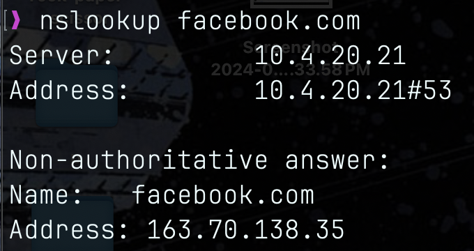

# Question3:
Suppose as a sysadmin, you need to figure out how to prevent students from connecting to machines outside IIIT over ssh (assume a regular configuration). For the purpose of this problem, assume that all traffic passes though a single Linux machine (think of it like your home Wi-Fi router) and it can run whatever you want it to (make reasonable assumptions).
1.  describe how you would accomplish this task using existing Linux tools and/or existing open source software.
2.  how does your answer change if you need to instead block http://facebook.com?
3.  (extra credit) how does your answer change if you need to instead block https://facebook.com?
4.  (extra credit) how does your answer change if you want to prevent clever students from trying to access ssh over non-standard ways?

## Answer:
### Part1:
- We can either `nfttables` or `iptables` to set up firewall on gateway machine.
- Then we can create some rule to block outgoing ssh connections (port22) from iiit network to external network. We can use the follwing command.
`nft add rule inet filter output tcp dport 22 drop`
- We can also set up `NAT` on gateway to allow clients to access internet while hiding their private addresses using `nftables` or `iptables` rules for nat and ip masquerading.
- We can also use [Tinyproxy](https://tinyproxy.github.io/) or [privoxy](https://www.privoxy.org/) for intercepting and inspecting network traffic and blocking outgoing ssh connections while allowing other traffic.
- Set up logging on firewall to keep track of blocked connections, suspicious activities adn voilations using tools like [logwatch](https://wiki.archlinux.org/title/Logwatch).

### Part2&3:
To block access to [facebook](https://facebook.com) instead of ssh connections we have to block port 80(for http) and port 443(for https)

- now using `nftables` and `iptables` to block ip addrs accociates with facebook.

`iptables -A OUTPUT -p tcp -d 163.70.138.35 -j REJECT`

`nft add rule inet filter output tcp daddr { 163.70.138.35 } drop`

- We can use proxys or content filters like `privoxy`, `E2Guardian` to block or [facebook](https://www.facebook.com/).

### Part4:
- To prevent students from accessing ssh over non-strd ways we can block non standard ssh ports like 1022, 2022 etc.
- We can also use Deep Packet Inspection (like [snort](https://www.snort.org/), [zeek](https://zeek.org/)) to analyze network traffic at application layer to identify ssh connections even if using standard port.