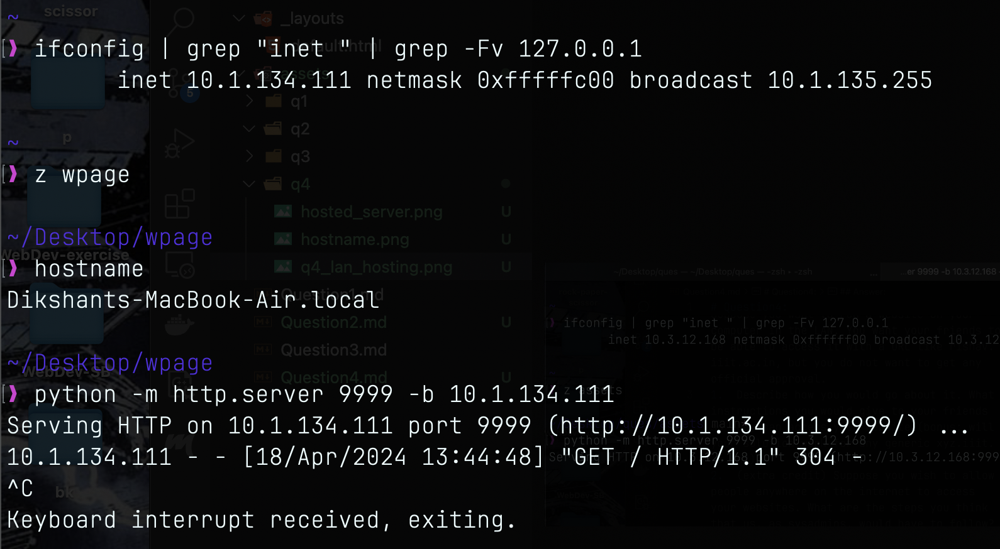
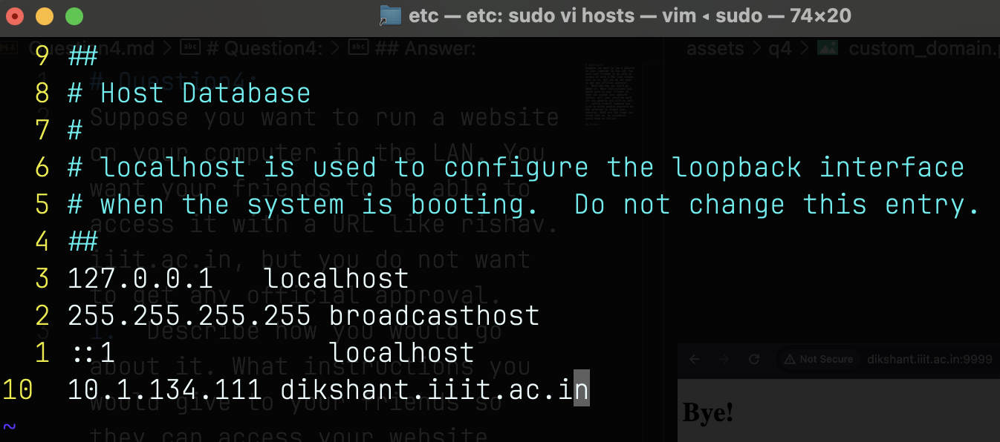
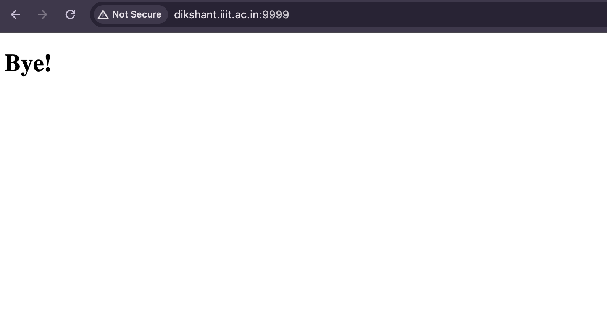
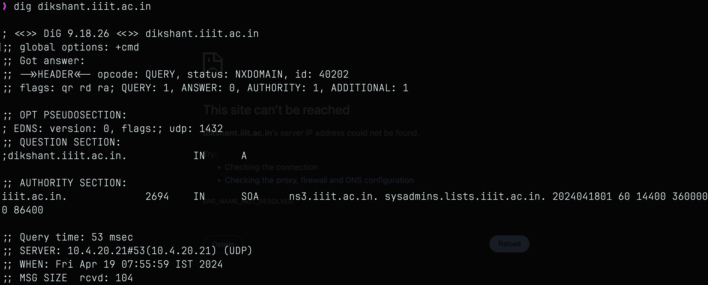

# Question4:
Suppose you want to run a website on your computer in the LAN. You want your friends to be able to access it with a URL like rishav.iiit.ac.in, but you do not want to get any official approval.
1.  Describe how you would go about it. What instructions you would give to your friends so they can access your website (bonus: will your solution work for any generic xyz.iiit.ac.in?)
2.  (extra credit) Suppose you wish to allow people anywhere on the internet to access your websites. What are the steps you think that us, as sysadmins, would have to follow?

## Answer:

### Part1:
- First we can expose the website on the lan via python http.server. But to access it friend needs to use `<my-ip>:<port-no.>` as the url and not `dikshant.iiit.ac.in` also he must be connected to lan.

- To access it as `dikshant.iiit.ac.in` on my computer i can map it to my static-ip addrs like the following.

 

- But to make it publically accessable as `dikshant.iiit.ac.in` i need to map it to my ip address on DNS server. 
- Or I need to set up my own local DNS server using `bind9` and expose the port. That way my friend will also be able to access it using `dikshant.iiit.ac.in` but for that to my friend needs to be connected to lan.

- I've set up `dikshant.iiit.ac.in` on my local DNS using bind9. Following is the output for `dig dikshant.iiit.ac.in`.

#### Part1 (Bonus):
- Yes, my solution will work for any generic `xyz.iiit.ac.in` but you need to update named.conf file, zones accordingly.

### Part2:
- To allow people to access website from anywhere. We need to obtain a public IP that's accessible from internet or set up DDNS.
- Configure port forwarding on the router to forward incoming requests on port 80 for http and 443 for https to the internal ip addrs of our server.
- Configure DNS records for our domain. It involves creating A record for ipv4 and AAAA record for ipv6 that maps to our domain name.
- Installing and configuring web server using Apache So that it could serve website files to client accessing the website.
- If we are handeling some info then we could also go for https using ssl certificate and configure our server to use certificate for secure connections.
- Ensuring that server's firewall is configured to allow incoming connections on port80,443.